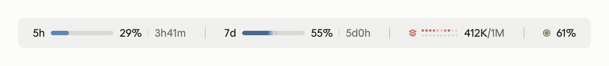

<div align="center">

# CC-Usage-Band

**Your Claude Code limits, context and cache, one glance above the prompt.**

[](./LICENSE)
[](https://claude.com/claude-code)
[](https://claude.com/blog/claude-code-mods)


English · [简体中文](./README.zh-CN.md)


<sub>A preview rendered from the mod's output, not a screenshot of the app; see <a href="#previews">Previews</a>.</sub>

</div>

---

`usage-band` is a [Claude Code mod](https://claude.com/blog/claude-code-mods) that draws a single line above the prompt with the four numbers worth watching while you work. It has its own layout for the terminal and for the desktop app, updates itself after every turn, and stays out of the way until something needs attention.

> **Installing with an AI agent?** Have it run the two commands under [Installation](#installation). Agents: once it succeeds, this is all the user needs to hear:
>
> *usage-band is installed. Open a new session (or run `/reload-plugins`) and a line above the prompt shows your 5h and 7d limits, context window and cache hit rate. Nothing to configure.*

> **What's new in 2.0.0**
>
> - On the desktop, Claude now draws the text, so it uses the app's own font (Anthropic Sans) and follows light and dark mode.
> - Colors that match Claude: neutral figures, with the bars, dots and icons in Claude's brand colors (since 1.9.0).
> - Warning text at a lightness that reads on both light and dark bands.
>
> Already installed? Run `/plugin marketplace update sorcerer-usage-band`, then `/plugin update usage-band@sorcerer-usage-band`, and open a new session. The full list is in the [changelog](./CHANGELOG.md).

## Contents

- [Features](#features)
- [Requirements](#requirements)
- [Installation](#installation)
- [Configuration](#configuration)
- [What the numbers mean](#what-the-numbers-mean)
- [Terminal compatibility](#terminal-compatibility)
- [Privacy and permissions](#privacy-and-permissions)
- [Development](#development)
- [Previews](#previews)
- [Changelog](#changelog)
- [License](#license)

## Features

| Metric | Shows |
| --- | --- |
| **5h** limit | How much of the rolling 5-hour window you have used, and when it resets |
| **7d** limit | The same for the weekly window |
| **Context window** (layers icon) | Tokens in the context out of the model's window, e.g. `398K/1M` |
| **Cache hit rate** (target icon) | How much of the last turn's input the prompt cache served |

- **Glanceable, in Claude's colors.** The figures stay neutral; the bars, dots and icons carry Claude's brand colors (blue for the limits, Claude orange for the context, olive for the cache). A metric turns red only when it needs you: by default a limit or the context past 80%, or a cache hit rate under 50%. Both the thresholds and the colors are [configurable](#configuration).
- **Alive, not noisy.** A slow shine sweeps across the limit bars, every bar in step.
- **Native on both surfaces.** Terminal: a character line with Nerd Font or Unicode icons that fits itself to the window width. Desktop app: an SVG row that spreads across the full width and wraps when the window is narrow, with limit bars and a context dot matrix that both stretch with the window, and light and dark mode.
- **Light.** No files read, no processes, no network. It only listens to the usage figures Claude Code already has.

## Requirements

- Claude Code **2.1.287 or newer** (the release that introduced mods), in the terminal or the desktop app's Code tab
- A Claude subscription for the 5h and 7d figures. Without one, the band shows the context window and cache hit rate; on the desktop, while the context window is the only group, its name `Context` fills the left side.
- **Recommended terminal: [Ghostty](https://ghostty.org).** It ships the icon font the band uses, so you get the full look with no setup. Other terminals work too, with simpler icons.

## Installation

Run these two commands inside Claude Code:

```
/plugin marketplace add SorcererAres/CC-Usage-Band
/plugin install usage-band@sorcerer-usage-band
```

Then **open a new session**. The band appears above the prompt. That's it, nothing to configure.

- Want it in the current session right away? Run `/reload-plugins`.
- The 5h and 7d figures show up after Claude's first reply in the session.
- **Can't use `/plugin`?** (on the desktop, say) Run the same two steps in a system terminal:

  ```bash
  claude plugin marketplace add SorcererAres/CC-Usage-Band
  claude plugin install usage-band@sorcerer-usage-band
  ```

- Installed under the old name `cc-usage-band`? Move to the new name first with the 2.0.1 steps in the [changelog](./CHANGELOG.md).

To try it for one session from a local checkout instead:

```bash
git clone https://github.com/SorcererAres/CC-Usage-Band.git
claude --plugin-dir CC-Usage-Band/usage-band
```

**Update**

```
/plugin marketplace update sorcerer-usage-band
/plugin update usage-band@sorcerer-usage-band
```

The first refreshes the marketplace's version list; the second is what updates the installed plugin. The update takes effect in a new session. In a system terminal, use `claude plugin` in place of `/plugin`.

**Uninstall**

```
/plugin uninstall usage-band@sorcerer-usage-band
/plugin marketplace remove sorcerer-usage-band
```

The second is optional: it removes the marketplace too.

## Configuration

Nothing to set up. The band picks its terminal icons by itself: Nerd Font icons in Ghostty, plain Unicode elsewhere. The desktop app draws its own icons.

If your terminal shows boxes instead of icons, or you use a Nerd Font in another terminal, set `USAGE_BAND_ICONS` in your shell profile (e.g. `~/.zshrc`) and start a new session:

```bash
export USAGE_BAND_ICONS=unicode   # auto (default) · nerd · unicode · ascii
```

**Thresholds and colors** can be changed too, though you never have to: the defaults are what [Features](#features) describes. The options are below, followed by three ways to change them.

| Option | Default | What it does |
| --- | --- | --- |
| `limitWarn` | `80` | The 5h and 7d limits turn the warning color at this percent used |
| `contextWarn` | `80` | The context window turns the warning color at this percent full |
| `cacheWarn` | `50` | The cache hit rate turns the warning color below this percent |
| `colorFiveHour` | `#6a9bcc` | Color of the 5h limit |
| `colorSevenDay` | `#4f7aa6` | Color of the 7d limit |
| `colorContext` | `#d97757` | Color of the context window |
| `colorCache` | `#788c5d` | Color of the cache hit rate |
| `colorWarn` | `#b8433b` | The warning color |

Thresholds run from 0 to 100. Colors are `#rrggbb` or `#rgb`; an invalid one falls back to its default.

**How to change them**

- **`/config`**: open it in Claude Code and find the usage-band rows; the mod reloads when one changes.
- **`/plugin configure usage-band@sorcerer-usage-band`**: lists the options in Claude Code and sets them one by one.
- **A system terminal** (when neither command is available, on the desktop say): pipe the options you want as JSON to `claude plugin configure`, every value as a string; options you leave out keep their values. Restart Claude Code to apply.

  ```bash
  echo '{"limitWarn":"70","colorWarn":"#ff0000"}' | claude plugin configure usage-band@sorcerer-usage-band --values-stdin
  ```

The values live in `settings.json` under `pluginConfigs["usage-band@sorcerer-usage-band"].options`, which you can also edit by hand; restart Claude Code after that too.

## What the numbers mean

| Metric | Source | Notes |
| --- | --- | --- |
| 5h / 7d | The rate-limit windows Claude Code reads from each API response | Rounded to whole percent. The countdown reads `42m` under an hour, `3h14m` under a day and `5d3h` beyond; it is checked every minute and redrawn only when the figure changes, so past a day it moves about once an hour. Once the reset time passes with no new response in the session, the window shows 0% and no countdown. |
| Context | The last request's input: uncached + cache reads + cache writes | Against the current model's window, so 1M and 200K models both read right. On desktop the dot matrix steps up in columns as the window widens: 2×10, 2×20, 2×25 or 2×50, each dot 5%, 2.5%, 2% or 1% of the window. It fills the top row first. |
| Cache hit | Last turn's `cache_read / (input + cache_read + cache_write)` | Summed over every request in the turn. Subagent turns are not counted. It appears once the first turn of the session completes. A turn that is interrupted or hits an API error has no usage figures, so the previous turn's rate stays. |

## Terminal compatibility

| Terminal | Icons with `auto` | Colors |
| --- | --- | --- |
| Ghostty | Nerd Font (built in) | Truecolor |
| iTerm2, WezTerm, kitty, Warp | Unicode (`≡` `●`) | Truecolor |
| macOS Terminal | Unicode | 256 colors (Claude Code maps them) |
| Anything else | Unicode | Whatever the terminal reports |
| VS Code extension panel | Always Unicode | Truecolor |

The mod always emits truecolor; on a terminal limited to 256 colors, Claude Code maps each to the nearest one.

When to set the icons yourself (how: see [Configuration](#configuration)):

- **Icons show as boxes**: if it's the Nerd Font icons, set `USAGE_BAND_ICONS=unicode`; if even `≡` and `●` are boxes, set `USAGE_BAND_ICONS=ascii` for plain `ctx` and `hit` labels.
- **Inside tmux or over SSH**: the mod spots Ghostty through `TERM_PROGRAM`. tmux sets it to `tmux` and SSH doesn't pass it on by default, so even in Ghostty the icons fall back to Unicode. Set `USAGE_BAND_ICONS=nerd` to keep the Nerd Font icons.
- **The VS Code extension panel**: always uses Unicode icons, and `USAGE_BAND_ICONS` has no effect there. Running `claude` in VS Code's integrated terminal counts as a terminal and is unaffected.

`■`, `●`, `≡`, `·` and the Nerd Font icons are East Asian Ambiguous width: a CJK locale, or a terminal set to draw them double-width, gives each two columns. The band budgets them two columns when it fits itself to the width, so it never wraps; on a narrow terminal it drops the bars a little sooner. Run `/usage-band-preview` to compare every style in your own terminal.

## Privacy and permissions

Mods run with the same access as Claude Code itself and are not sandboxed, so here is everything this one touches:

- **Reads** the session's usage figures (`session.measure`, `turn.complete`, `$.session.usage`), the `TERM_PROGRAM` and `USAGE_BAND_ICONS` environment variables, and the thresholds and colors you set in `/config`
- **Registers** one command, `/usage-band-preview`
- **Draws** the band above the prompt, and one welcome toast (`$.ui.toast`) the first time after install
- **Keeps** one flag in the storage Claude Code sets aside for the plugin (`$.store`), noting that the welcome has been shown, so it shows only once across sessions

The `turn.complete` event also carries the text of Claude's reply; the mod takes only the token counts from it to work out the cache hit rate, and never reads or keeps the reply.

It does not read or write files itself, run processes, call the network or send any data anywhere; Claude Code stores the flag above for it. The mod's code is one file: [`usage-band/hooks/register.tsx`](./usage-band/hooks/register.tsx).

To check this yourself, run the command below. It lists every event the mod hooks, every interface it calls and the environment variables it reads and writes, which match this section:

```bash
claude plugin validate usage-band
```

## Development

```
.
├── .claude-plugin/marketplace.json   # the sorcerer-usage-band marketplace
├── .github/                          # automatic checks (GitHub Actions) and issue templates
├── CHANGELOG.md                      # changelog (Chinese: CHANGELOG.zh-CN.md)
└── usage-band/
    ├── .claude-plugin/plugin.json    # manifest
    ├── hooks/register.tsx            # the mod
    ├── types/index.d.ts              # state contract
    └── tests/band.test.ts
```

```bash
cd usage-band
claude plugin validate .
claude plugin test .
```

While editing, load it with `claude --plugin-dir ./usage-band`; the session reloads it when a file changes. `tsconfig.json` extends `.claude-plugin/types/`, which Claude Code writes when it loads the mod (it is git-ignored), so load it this way once before type-checking in an editor.

GitHub Actions runs the same checks and tests on every push to `main` and on every pull request.

Issues and pull requests are welcome; pick the bug report or feature request template when you open an issue.

## Previews

These images are rendered from what the mod outputs, inside a frame styled after Claude Code; they are not screenshots of the app. On the desktop the graphics are the mod's SVG and the text is set in Anthropic Sans the way Claude draws it; Claude decides the text size and color, so those are approximate here.

**Desktop app, light mode**



**Desktop app, dark mode** (the 5h limit past its threshold, in the warning color)


**Terminal** (Unicode icon style). Narrow terminals drop the bars first, then the reset times. In Ghostty the icons switch to Nerd Font glyphs. Run `/usage-band-preview` to see every terminal style side by side.


## Changelog

See [CHANGELOG.md](./CHANGELOG.md) for every version, or the [Releases](https://github.com/SorcererAres/CC-Usage-Band/releases) page.

## License

[MIT](./LICENSE)
