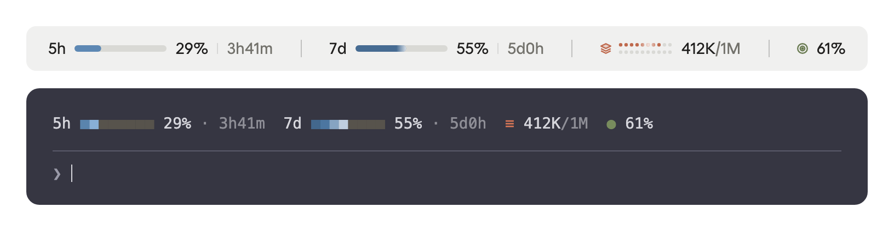
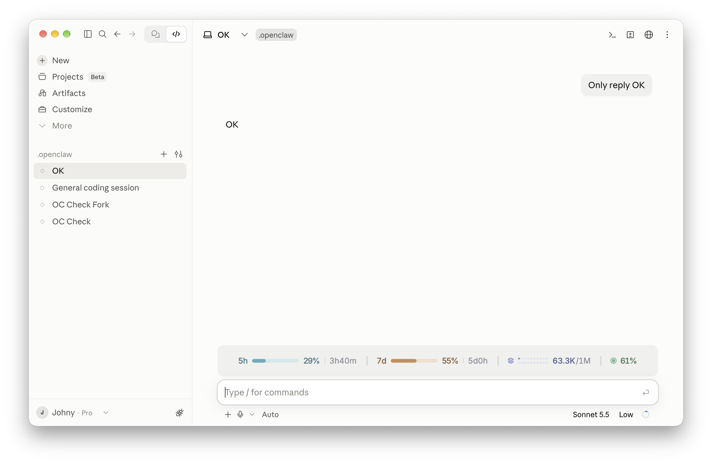
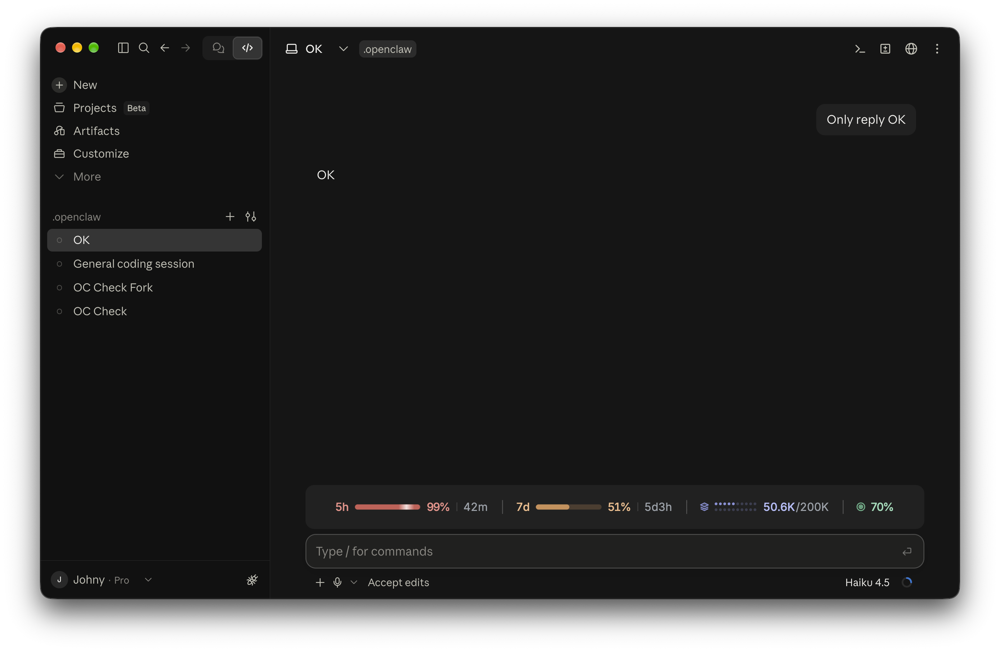
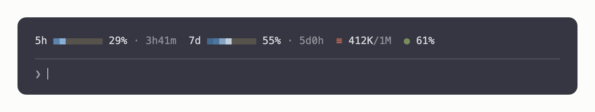

<div align="center">

# CC-Usage-Band

**额度、上下文、缓存命中率，在输入框上方一眼看清。**

[](./LICENSE)
[](https://claude.com/claude-code)
[](https://claude.com/blog/claude-code-mods)


[English](./README.md) · 简体中文



</div>

---

`usage-band` 是一个 [Claude Code 模组（mod）](https://claude.com/blog/claude-code-mods)。它在输入框上方显示一行状态，包含工作时最值得留意的四个数据。终端和桌面端各有一套专门的布局，每一轮对话结束后自动更新，平时安静地待着，只在需要注意时才变红提醒你。

> **让 AI 助手帮你安装？** 让它运行[安装](#安装)里的两条命令即可。给 AI 助手的说明：安装成功后，用户只需要知道下面这段话：
>
> *usage-band 已安装。新开一个会话（或输入 `/reload-plugins`），输入框上方就会显示 5h 和 7d 额度、上下文窗口和缓存命中率。不需要任何配置。*

## 目录

- [功能](#功能)
- [使用要求](#使用要求)
- [安装](#安装)
- [设置](#设置)
- [数据说明](#数据说明)
- [终端兼容性](#终端兼容性)
- [隐私与权限](#隐私与权限)
- [开发](#开发)
- [截图](#截图)
- [更新日志](#更新日志)
- [许可证](#许可证)

## 功能

| 指标 | 显示内容 |
| --- | --- |
| **5h** 额度 | 5 小时滚动额度已用了多少，以及还有多久重置 |
| **7d** 额度 | 7 天额度的用量和重置时间 |
| **上下文窗口**（图层图标） | 当前上下文占用的 token 数和模型窗口大小，例如 `398K/1M` |
| **缓存命中率**（靶心图标） | 上一轮输入中有多少由提示缓存提供 |

- **一眼看清，配色跟 Claude 一致**：数字保持中性，进度条、点阵和图标用 Claude 的品牌色（额度用蓝、上下文用 Claude 橙、缓存用橄榄绿）。只有在需要注意时才会变红：默认是额度或上下文超过 80%，或者缓存命中率低于 50%。阈值和颜色都可以[自己设置](#设置)。
- **有动感但不打扰**：额度进度条上有一道缓慢的扫光，所有进度条同步移动。
- **两端原生适配**：
  - 终端里是一行字符，图标可以用 Nerd Font 或普通 Unicode 字符，并且会根据窗口宽度自动调整显示的内容。
  - 桌面端是一行 SVG 图形，横向铺满整行，额度进度条和上下文点阵随窗口宽度伸缩，只剩上下文一组时左侧显示它的名称，窗口太窄时自动换行；额度用进度条显示，上下文用两行点阵灯显示（2×10 到 2×50 分档），并且支持浅色和深色模式。
- **轻量**：不读文件、不运行程序、不联网，只读取 Claude Code 本来就有的用量数据。

## 使用要求

- Claude Code **2.1.287 或更新版本**（模组功能是从这个版本开始提供的），终端和桌面端的 Code 页都可以用。
- 5h 和 7d 额度只有订阅账号才有数据。没有订阅时，这一行显示上下文和缓存命中率；桌面端在只剩上下文一组时，左侧会显示它的名称 `Context`。
- **推荐搭配 [Ghostty](https://ghostty.org) 终端使用。** Ghostty 自带这一行用到的图标字体，不用做任何设置就能看到完整效果。其他终端也能用，图标会简单一些。

## 安装

在 Claude Code 里输入这两条命令：

```
/plugin marketplace add SorcererAres/CC-Usage-Band
/plugin install usage-band@cc-usage-band
```

然后**新开一个会话**，输入框上方就会出现这一行。就这么简单，不需要任何配置。

- 想在当前会话里马上看到？输入 `/reload-plugins`。
- 5h 和 7d 额度要等会话里 Claude 第一次回复后才会显示。

如果只想在一个会话里临时试用，可以从本地克隆后加载：

```bash
git clone https://github.com/SorcererAres/CC-Usage-Band.git
claude --plugin-dir CC-Usage-Band/usage-band
```

**更新**

```
/plugin marketplace update cc-usage-band
```

**卸载**

```
/plugin uninstall usage-band@cc-usage-band
```

## 设置

不需要任何设置。终端里的图标会自动选择：在 Ghostty 里用 Nerd Font 图标，在其他终端里用普通 Unicode 字符。桌面端的图标是自己画的。

如果终端里的图标显示成方框，或者你在别的终端里也装了 Nerd Font，可以在 shell 配置文件（比如 `~/.zshrc`）里加一行，然后新开一个会话：

```bash
export USAGE_BAND_ICONS=unicode   # auto（默认）· nerd · unicode · ascii
```

**阈值和颜色**也可以改，但不是必须的，默认就是上面「功能」里说的效果。在 Claude Code 里打开 `/config`，找到 usage-band 的这几项，改完插件会自动重新加载：

| 选项 | 默认值 | 作用 |
| --- | --- | --- |
| `limitWarn` | `80` | 5h 和 7d 额度用量达到这个百分比时变成警示色 |
| `contextWarn` | `80` | 上下文占用达到这个百分比时变成警示色 |
| `cacheWarn` | `50` | 缓存命中率低于这个百分比时变成警示色 |
| `colorFiveHour` | `#6a9bcc` | 5h 额度的颜色 |
| `colorSevenDay` | `#4f7aa6` | 7d 额度的颜色 |
| `colorContext` | `#d97757` | 上下文的颜色 |
| `colorCache` | `#788c5d` | 缓存命中率的颜色 |
| `colorWarn` | `#b8433b` | 警示色 |

阈值的取值范围是 0–100。颜色写成 `#rrggbb` 或 `#rgb`，填错时会退回默认值。这些值保存在 `settings.json` 的 `pluginConfigs["usage-band"].options` 里，也可以直接编辑这个文件。

## 数据说明

| 指标 | 数据来源 | 说明 |
| --- | --- | --- |
| 5h / 7d | Claude Code 从每次 API 响应中读到的额度窗口 | 四舍五入到整数百分比，重置倒计时每分钟更新一次。重置时间到了而会话里还没有新的响应时，按 0% 显示，不再显示倒计时。 |
| 上下文 | 最后一次请求的输入总量：未缓存部分 + 缓存读取 + 缓存写入 | 按当前模型的窗口大小计算，1M 和 200K 的模型都能正确显示。桌面端的点阵随宽度分档增加列数：2×10、2×20、2×25、2×50，每个点分别代表窗口的 5%、2.5%、2%、1%。先点亮上排，再点亮下排。 |
| 缓存命中率 | 上一轮的 `缓存读取 / (未缓存输入 + 缓存读取 + 缓存写入)` | 把这一轮里所有请求加总后计算，不包括子代理的轮次。 |

## 终端兼容性

| 终端 | `auto` 下的图标 | 颜色 |
| --- | --- | --- |
| Ghostty | Nerd Font（自带） | 真彩色 |
| iTerm2、WezTerm、kitty、Warp | Unicode（`≡` `●`） | 真彩色 |
| macOS 自带终端 | Unicode | 256 色，自动换算 |
| 其他终端 | Unicode | 按终端支持的颜色显示 |

如果图标显示成方框，设置 `USAGE_BAND_ICONS=unicode` 就行（见[设置](#设置)）。

`■`、`●`、`≡`、`·` 和 Nerd Font 图标属于东亚「宽度不确定」字符，在中文、日文等 CJK 环境或开启了双宽显示的终端里会占两列。这一行估算宽度时一律按两列计算，所以不会溢出折行，代价是窄终端里会稍早去掉进度条。可以运行 `/usage-band-preview`，在你自己的终端里对比所有样式。

## 隐私与权限

模组运行时的权限和 Claude Code 本身一样，没有沙箱隔离。所以这里列出这个模组会接触的全部内容：

- **读取**：会话的用量数据（`session.measure`、`turn.complete`、`$.session.usage`），环境变量 `TERM_PROGRAM` 和 `USAGE_BAND_ICONS`，以及你在 `/config` 里设置的阈值和颜色
- **注册**：一个命令 `/usage-band-preview`
- **绘制**：输入框上方的这一行

它不读写文件、不运行程序、不联网，也不会把任何数据发送到任何地方。整个模组只有一个文件：[`usage-band/hooks/register.tsx`](./usage-band/hooks/register.tsx)。

## 开发

```
.
├── .claude-plugin/marketplace.json   # cc-usage-band 插件市场
└── usage-band/
    ├── .claude-plugin/plugin.json    # 插件信息
    ├── hooks/register.tsx            # 模组代码
    ├── types/index.d.ts              # 状态类型定义
    └── tests/band.test.ts
```

```bash
cd usage-band
claude plugin validate .
claude plugin test .
```

修改时用 `claude --plugin-dir ./usage-band` 加载，文件一保存，会话就会自动重新加载。`tsconfig.json` 继承的 `.claude-plugin/types/` 由 Claude Code 在加载模组时生成（已加入 `.gitignore`），所以第一次用编辑器做类型检查之前，需要先这样加载一次。

欢迎提交 Issue 和 Pull Request。

## 截图

以下图片由 1.9.0 版插件实际输出的 SVG 与终端文字渲染而成，外框按 Claude Code 的样式仿制，并非应用界面截图。2.0.0 起桌面端文字改用 Claude 界面字体，实际字形与图中略有不同。

**桌面端，浅色模式**



**桌面端，深色模式**（5h 额度超过阈值，显示警示色）



**终端**（Unicode 图标样式）：宽度不够时会先去掉进度条，再去掉重置时间。在 Ghostty 里会自动换成 Nerd Font 图标。运行 `/usage-band-preview` 可以并排对比所有终端样式。



## 更新日志

### 2.0.0（2026-10-04）

桌面端的文字改由 Claude 自己绘制，字体与界面一致。

- **字体与 Claude 一致**：`5h`、`29%`、`3h41m`、`412K/1M` 这些文字不再画在 SVG 里，而是交给 Claude 界面绘制，自动用上界面的 Anthropic Sans 字体和正文颜色，浅色、深色模式自动切换。此前 SVG 里的文字用不了应用自带的字体，实际显示的是系统字体 SF Pro。
- **只有图形还是 SVG**：进度条、点阵、图标和分隔线保持不变，扫光依旧同步。
- **警示色改为中间亮度**：界面文字只能指定一种颜色，所以警示红调到在浅色和深色底上都看得清的亮度（对比度约 3.7）。
- **无障碍**：每组的第一张图形带上这一组的说明（如「5-hour limit 29% used」），读屏软件可以读到。
- 字号、字重由 Claude 决定，插件不再控制；数字变化时宽度可能有一两像素的轻微变化。
- 版本号升到 2.0.0：桌面端的绘制方式整体换了一套。

### 1.9.0（2026-10-04）

配色改为 Claude 的品牌风格。

- **新的默认配色**：5h 额度蓝色 `#6a9bcc`、7d 额度深蓝 `#4f7aa6`、上下文 Claude 橙 `#d97757`、缓存命中率橄榄绿 `#788c5d`；警示色改为更深的红 `#b8433b`，和橙色拉开距离。
- **数字保持中性**：数字和标签平时用中性的暖深灰（深色模式下暖浅灰），只有超过阈值时才变成警示色。终端里的数字改用终端自己的前景色。
- **只有图形带颜色**：进度条、点阵和图标在浅色模式下略压暗、深色模式下略调亮，两种底色上都看得清；进度条和点阵的底轨统一为暖灰。
- **更易读**：倒计时、`/1M` 这类次要文字在浅色模式下加深，对比度从 3.28 提升到 4.6。两种模式下图形对比度都不低于 3:1，文字都不低于 4.5:1。
- `/config` 里各颜色选项的默认值同步更新；想用原来的颜色，可以在那里改回去。

### 更早的版本

- **1.8.0**：桌面端这一行变矮，整行高度从约 51px 降到约 41px。
- **1.7.0**：去掉会话费用显示（订阅账号在第一次回复前会被误判为按量计费，显示出并不需要支付的金额）；桌面端只剩上下文一组时，左侧显示名称 `Context`。
- **1.6.0**：终端也显示会话费用（已在 1.7.0 去掉）。
- **1.5.0**：上下文点阵按整刻度分档（2×10、2×20、2×25、2×50）；只剩一组时居中；按量计费账号显示会话费用（已在 1.7.0 去掉）。
- **1.4.0**：桌面端上下文点阵随窗口宽度伸缩。
- **1.3.0**：桌面端额度进度条随窗口宽度伸缩。
- **1.2.0**：桌面端改为横向铺满整行，窗口太窄时自动换行。
- **1.1.0 / 1.0.7**：在 [JetsonChan/CC-Usage-Band](https://github.com/JetsonChan/CC-Usage-Band) 1.0.6 的基础上二次开发。修复中文等 CJK 终端里这一行溢出折行、终端动画持续重绘、额度重置后读数过期、缓存命中率可能显示 `NaN%` 等问题；阈值和颜色可在 `/config` 中配置。

## 许可证

[MIT](./LICENSE) © Jetson Chan
